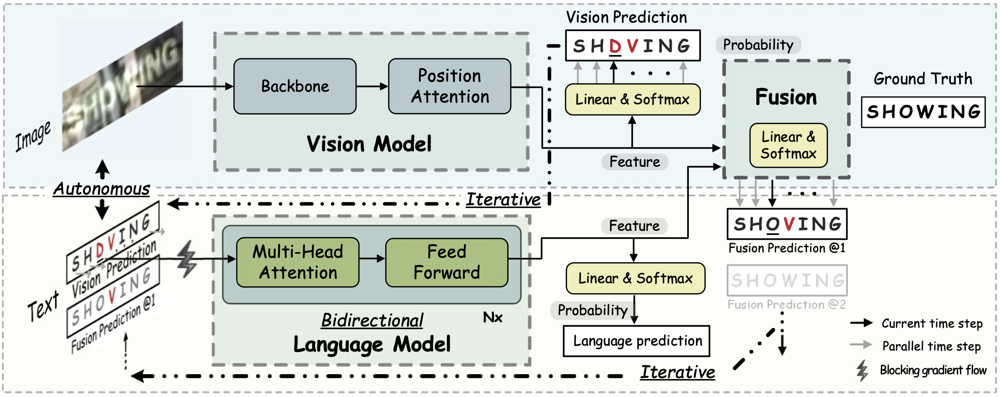

# Read Like Humans: Autonomous, Bidirectional and Iterative Language Modeling for Scene Text Recognition

The unofficial code of [ABINet](https://arxiv.org/pdf/2103.06495.pdf) (CVPR 2021, Oral).

ABINet uses a vision model and an explicit language model to recognize text in the wild, which are trained in end-to-end way. The language model (BCN) achieves bidirectional language representation in simulating cloze test, additionally utilizing iterative correction strategy.



### Pretrained Models

Get the pretrained models from [BaiduNetdisk(passwd:kwck)](https://pan.baidu.com/s/1b3vyvPwvh_75FkPlp87czQ), [GoogleDrive](https://drive.google.com/file/d/1mYM_26qHUom_5NU7iutHneB_KHlLjL5y/view?usp=sharing). Performances of the pretrained models are summaried as follows:

## Training

1. Pre-train vision model
    ```
    CUDA_VISIBLE_DEVICES=0,1,2,3 python main.py --config=configs/pretrain_vision_model.yaml
    ```
2. Pre-train language model
    ```
    CUDA_VISIBLE_DEVICES=0,1,2,3 python main.py --config=configs/pretrain_language_model.yaml
    ```
3. Train ABINet
    ```
    CUDA_VISIBLE_DEVICES=0,1,2,3 python main.py --config=configs/train_abinet.yaml
    ```
Note:
- You can set the `checkpoint` path for vision and language models separately for specific pretrained model, or set to `None` to train from scratch


## Evaluation

```
CUDA_VISIBLE_DEVICES=0 python main.py --config=configs/train_abinet.yaml --phase test --image_only
```
Additional flags:
- `--checkpoint /path/to/checkpoint` set the path of evaluation model 
- `--test_root /path/to/dataset` set the path of evaluation dataset
- `--model_eval [alignment|vision]` which sub-model to evaluate
- `--image_only` disable dumping visualization of attention masks

## Run Demo

```
python demo.py --config=configs/train_abinet.yaml --input=figs/test
```
Additional flags:
- `--config /path/to/config` set the path of configuration file 
- `--input /path/to/image-directory` set the path of image directory or wildcard path, e.g, `--input='figs/test/*.png'`
- `--checkpoint /path/to/checkpoint` set the path of trained model
- `--cuda [-1|0|1|2|3...]` set the cuda id, by default -1 is set and stands for cpu
- `--model_eval [alignment|vision]` which sub-model to use
- `--image_only` disable dumping visualization of attention masks

## Citation
If you find our method useful for your reserach, please cite
```bash 
@article{fang2021read,
  title={Read Like Humans: Autonomous, Bidirectional and Iterative Language Modeling for Scene Text Recognition},
  author={Fang, Shancheng and Xie, Hongtao and Wang, Yuxin and Mao, Zhendong and Zhang, Yongdong},
    booktitle={Proceedings of the IEEE/CVF Conference on Computer Vision and Pattern Recognition},
  year={2021}
}
 ```
