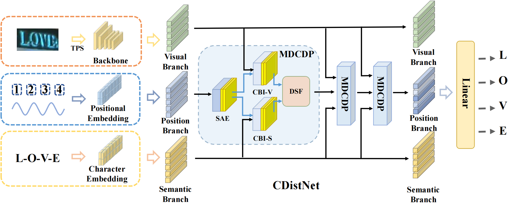

# CDistNet: Perceiving Multi-Domain Character Distance for Robust Text Recognition

The unofficial code of CDistNet.

Paper Link : [Arxiv Link](http://arxiv.org/abs/2111.11011) 




## arguments
***You have to go to configs.CDistNet_config.py and edit it yourself.***
- **dist_vocab**: Text path of character to use as class
- **dist_vocab_size**: The number of characters to use as a class
- **train.gt_file**: path to train lmdb
- **train.num_epochs**: num of train epochs
- **val.gt_file**: path to evaulation lmdb
- **test.best_acc_test**: Whether to use the best accuarcy pth file - mine
- **test.s_epoch,e_epoch, avg_e**: epochs of the model.pth file to be tested
- **tst.test_list**: ldmb path to test**
- **test.model_dir**: model.pth path to test
- **test.save_dir**: Path to save test results
- **test.python_path**: Your python path

## Datasets
**The datasets are same as ABINet**
- Training datasets

    1. [MJSynth](http://www.robots.ox.ac.uk/~vgg/data/text/) (MJ): 
        - [LMDB dataset BaiduNetdisk(passwd:n23k)](https://pan.baidu.com/s/1mgnTiyoR8f6Cm655rFI4HQ)
    2. [SynthText](http://www.robots.ox.ac.uk/~vgg/data/scenetext/) (ST):
        - [LMDB dataset BaiduNetdisk(passwd:n23k)](https://pan.baidu.com/s/1mgnTiyoR8f6Cm655rFI4HQ)

- Augment IC13
  - HA-IC13 & CA-IC13 : [BaiduNetdisk(passwd:d6jd)](https://pan.baidu.com/s/1s0oNmd5jQJCvoH1efjfBdg), [GoogleDrive](https://drive.google.com/drive/folders/1PTPFjDdx2Ky0KsZdgn0p9x5fqyrdxKWF?usp=sharing)

- The structure of `dataset` directory is
    ```
    dataset
    ├── eval
    │   ├── CUTE80
    │   ├── IC13_857
    │   ├── IC15_1811
    │   ├── IIIT5k_3000
    │   ├── SVT
    │   └── SVTP
    ├── train
    │   ├── MJ
    │   │   ├── MJ_test
    │   │   ├── MJ_train
    │   │   └── MJ_valid
    │   └── ST
    ```
## Environment
package you can find in `env_cdistnet.yaml`.
```
#Installed
conda create -n CDistNet python=3.7
conda install pytorch==1.5.1 torchvision==0.6.1 cudatoolkit=9.2 -c pytorch
pip install opencv-python mmcv notebook numpy einops tensorboardX Pillow thop timm tornado tqdm matplotlib lmdb
```
## Pretrained Models

Get the pretrained models from [BaiduNetdisk(passwd:d6jd)](https://pan.baidu.com/s/1s0oNmd5jQJCvoH1efjfBdg), [GoogleDrive](https://drive.google.com/drive/folders/1PTPFjDdx2Ky0KsZdgn0p9x5fqyrdxKWF?usp=sharing). 
(We both offer training log and result.csv in same file.)
The pretrained model should set in `models/reconstruct_CDistNetv3_3_10`

Performances of the pretrained models are summaried as follows:

[comment]: <> (|Model|GPUs|IC13|SVT|IIIT|IC15|SVTP|CUTE|AVG|)

[comment]: <> (|-|-|-|-|-|-|-|-|-|)

[comment]: <> (|CDistNet&#40;paper&#41;|6|97.67|93.82|96.57|86.25|89.77|89.58|92.28|)

[comment]: <> (|CDistNet&#40;rebuild&#41;|4|97.43|93.51|96.37|86.03|88.68|93.4|92.57|)

## Train
`CUDA_VISIBLE_DEVICES=0,1,2,3 python train.py --config=configs/CDistNet_config.py`
## Eval
`CUDA_VISIBLE_DEVICES=0 python eval.py --config=configs/CDistNet_config.py`
## Citation
```bash 
@article{Zheng2021CDistNetPM,
  title={CDistNet: Perceiving Multi-Domain Character Distance for Robust Text Recognition},
  author={Tianlun Zheng and Zhineng Chen and Shancheng Fang and Hongtao Xie and Yu-Gang Jiang},
  journal={ArXiv},
  year={2021},
  volume={abs/2111.11011}
}
```
